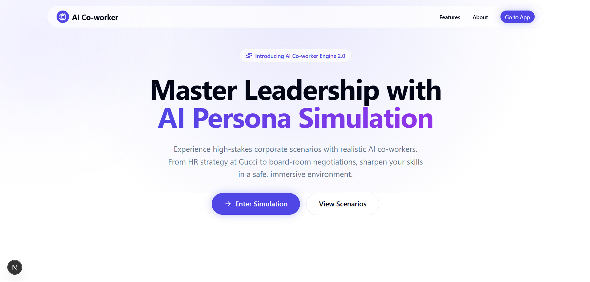
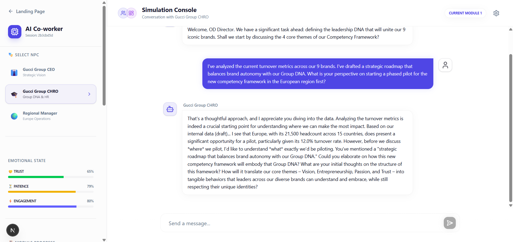
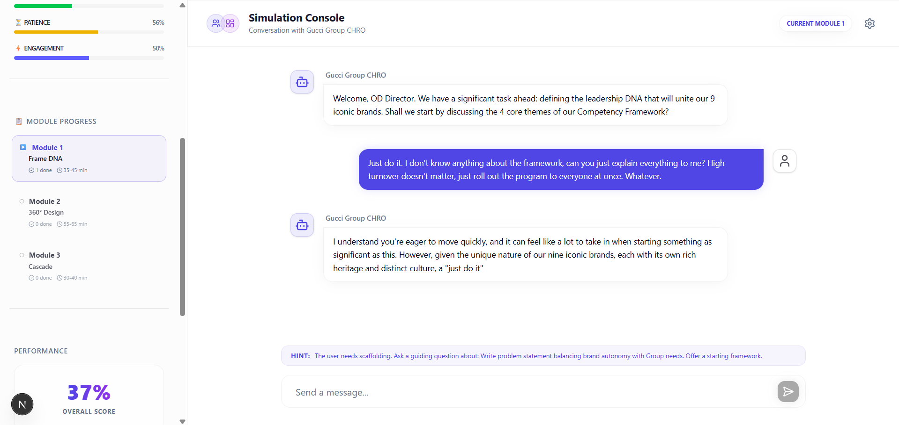
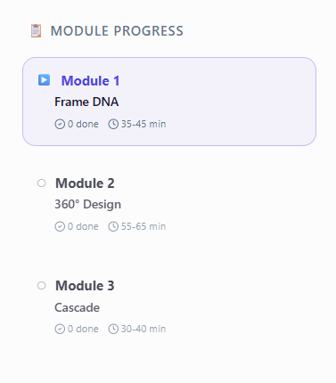

# AI Co-worker Engine: Gucci Group Leadership Simulation

Edtronaut - AI Engineer Intern Take-home Assignment
Scalable AI Co-worker Engine for job simulations.
Prototype: Gucci Group - HRM Talent & Leadership Development

---

## Business Value

This project is more than just a chat application; it's a complete Leadership Assessment Ecosystem:

*   Multi-Personas: Interact with the CEO, CHRO, and Regional Manager. Each AI has unique memory and emotional states (Trust/Patience/Engagement) that evolve based on your communication style.
*   Director Layer: An invisible AI supervisor monitors task progress and provides subtle hints if you get stuck or veer off-course.
*   Automatic Competency Mapping: The task roadmap updates in real-time as the AI identifies professional actions within your conversation.
*   Safety & Security: Built-in guardrails to prevent jailbreak attempts and ensure the simulation stays focused on professional HRM topics.

---

## UI Overview


---

## System Architecture

The project is built on a modern high-performance tech stack:
*   Backend: Python & FastAPI (High-speed AI logic processing).
*   AI Orchestration: LangGraph (Advanced stateful conversation management).
*   Frontend: Next.js 15 & Tailwind CSS (Premium, smooth, and responsive interface).

---

## AI Intelligence Tiers

The engine supports two tiers of intelligence, switchable via configuration:

### 1. Hybrid Mock LLM (Default)
A high-fidelity, deterministic simulation engine designed for rapid prototyping and zero-cost demos.
*   Keyword-driven logic: Classifies user intent to provide high-quality, persona-consistent responses.
*   Emotional reactivity: Dynamically adjusts tone (Trust, Patience) without API calls.
*   Director integration: Seamlessly weaves hidden monitoring hints into the conversation.
*   Offline capability: Works 100% locally with zero latency.

### 2. Google Gemini 2.5 Flash Integration
For production-grade reasoning and open-ended simulations.
*   Powered by gemini-2.5-flash: Utilizing the latest and fastest generative AI from Google.
*   Safety-grounded: Uses complex system instructions to maintain persona integrity and simulation guardrails.
*   Dynamic emotional calibration: Passes real-time emotional vectors to the LLM to steer the AI's "attitude" during roleplay.

---

## Execution Guide (For HR & Developers)


### Step 1: Backend Setup (Python)
1.  Ensure you have Python 3.10+ installed.
2.  Open a terminal in the root directory and run:
    ```bash
    pip install -r requirements.txt
    python -m src.main
    ```
    *(Note: **Mock Mode is active by default**. The engine will run out-of-the-box without requiring any AI API keys, perfect for immediate evaluation.)*

(The backend will run at: http://127.0.0.1:8000)

### Step 2: Frontend Setup (Web UI)
1.  Open a new terminal and navigate to the web directory:
    ```bash
    cd web-ui
    npm install
    npm run dev
    ```
2.  Open your browser and visit: http://localhost:3000

---

## Feature Showcases

### Interaction Analysis (Good vs Bad)
The system reacts dynamically to your leadership style.

| Good Interaction | Bad Interaction |
|:---:|:---:|
|  |  |

### Real-time Progress Tracking


---

## Project Structure

*   src/agents/: Core system logic (Director, NPC Logic, Workflow).
*   src/personas/: AI personality definitions (CEO, CHRO, etc.).
*   src/state/: AI memory and emotional state management.
*   web-ui/: Modern Next.js frontend source code.

---


